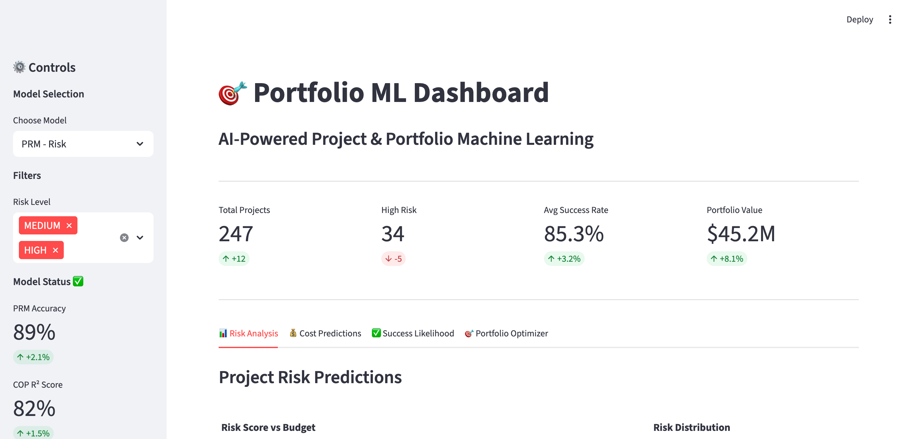
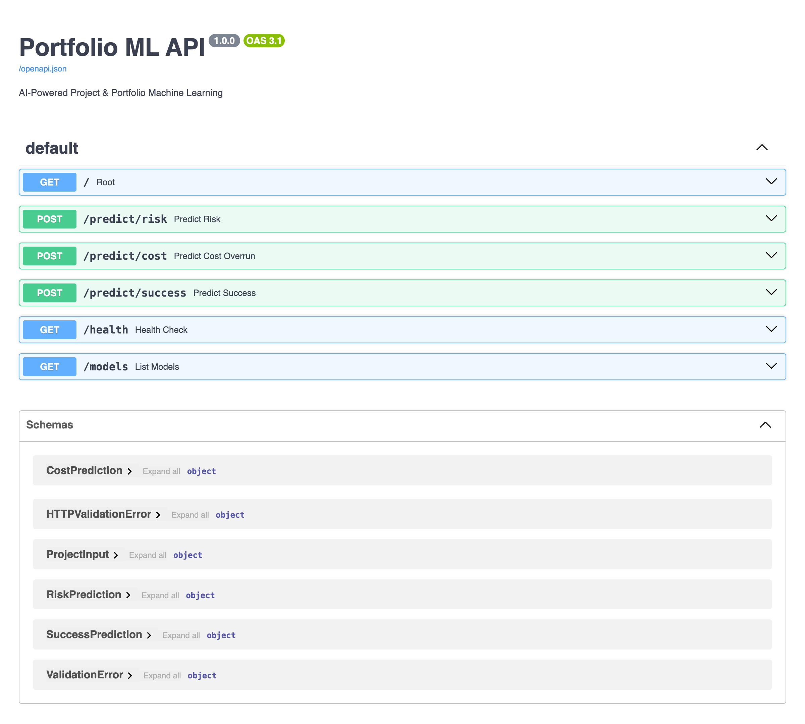
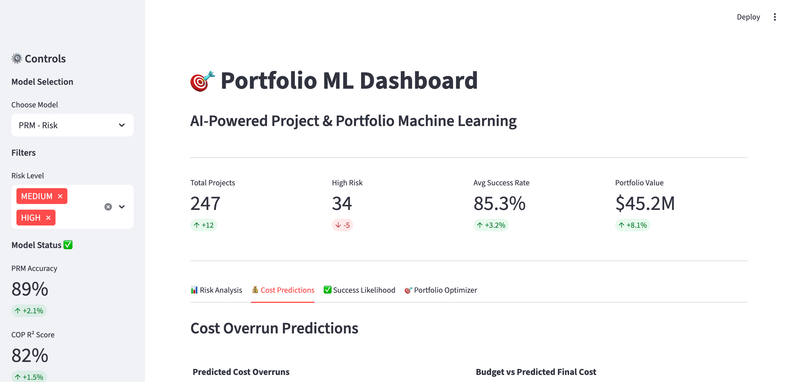
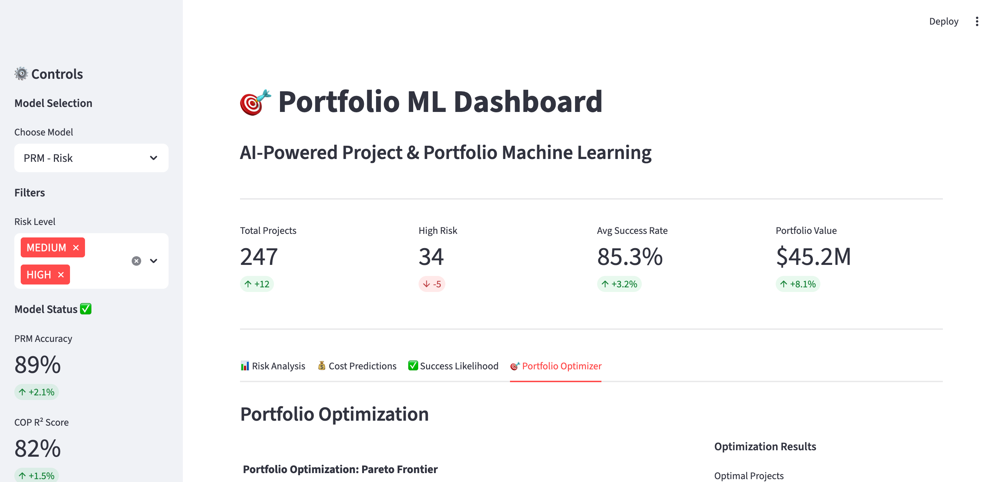
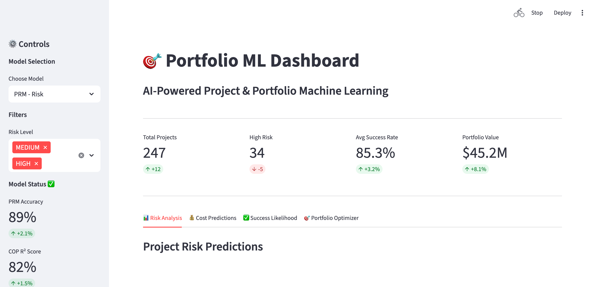
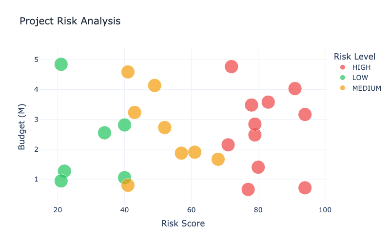
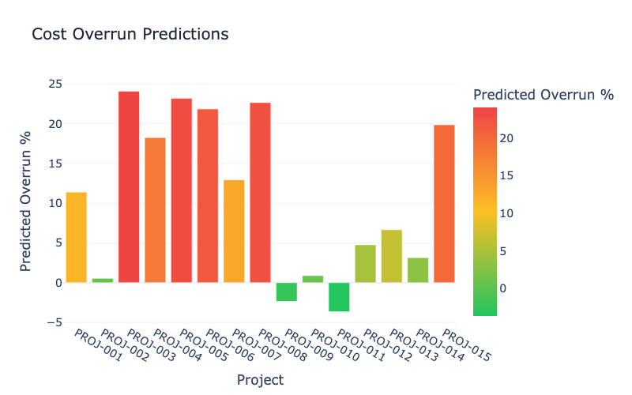
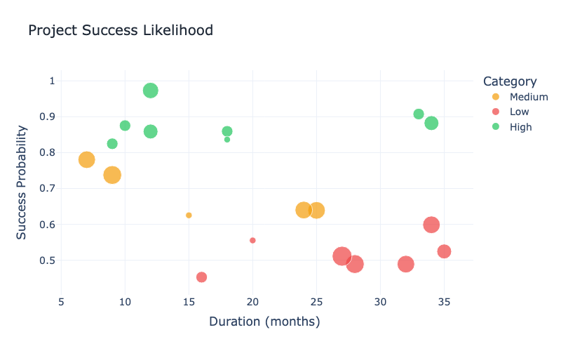
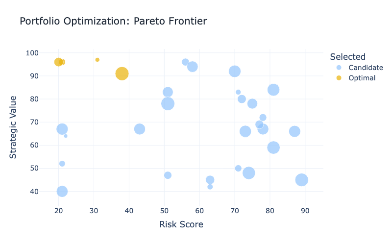
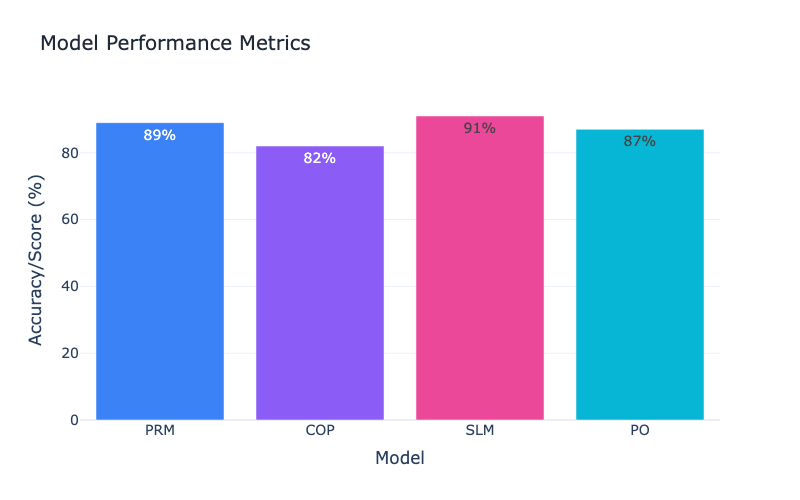

<div align="center">

# 🎯 Portfolio ML
### AI-Powered Project & Portfolio Machine Learning Models

[](https://www.python.org/downloads/)
[](https://fastapi.tiangolo.com/)
[](LICENSE)
[](.github/workflows/ci.yml)
[](https://mlflow.org/)
[](https://github.com/psf/black)

**Predictive analytics for Project Portfolio Management (PPM) powered by Machine Learning**

[Features](#-features) • [Quick Start](#-quick-start) • [API](#-api) • [Dashboard](#-dashboard) • [Screenshots](#-screenshots) • [Architecture](docs/ARCHITECTURE.md)

</div>

---

## 📸 Screenshots

<div align="center">

### 🎨 Dashboard Interface - Risk Analysis



*Interactive Streamlit dashboard with real-time risk predictions, scatter plots, and data tables*

### 🌐 API Documentation



*FastAPI interactive documentation with all endpoints, request/response schemas, and try-it-out functionality*

### 💰 Cost Overrun Predictions



*Cost overrun predictions with bar charts and budget vs predicted cost analysis*

### 🎯 Portfolio Optimizer - Pareto Frontier



*Portfolio optimization with Pareto frontier visualization showing optimal project selection*

### 📊 Full Dashboard Overview



*Complete dashboard view with metrics, charts, and performance trends*

</div>

---

## 📊 Visual Analytics

<div align="center">

### 🎯 Project Risk Analysis


*Real-time risk assessment across project portfolio with budget impact analysis*

### 💰 Cost Overrun Predictions


*ML-powered cost overrun forecasting with confidence intervals*

### ✅ Success Likelihood Model


*Project success probability analysis based on team experience and duration*

### 🎯 Portfolio Optimization


*Pareto frontier visualization for optimal project selection*

### 📈 Model Performance Dashboard


*Live performance metrics across all ML models*

</div>

---

## 🌟 Features

<table>
<tr>
<td width="50%">

### 🤖 **4 Core ML Models**

- 🎲 **Project Risk Model (PRM)**
  - Predicts schedule slippage
  - Budget overrun detection
  - Resource bottleneck forecasting

- 💰 **Cost Overrun Predictor (COP)**
  - Cost overrun probability
  - Magnitude forecasting
  - Financial risk assessment

</td>
<td width="50%">

### 📊 **Advanced Analytics**

- ✅ **Success Likelihood Model (SLM)**
  - Project success probability
  - Historical pattern analysis
  - Outcome prediction

- 🎯 **Portfolio Optimizer (PO)**
  - Optimal project selection
  - Resource allocation
  - Value maximization

</td>
</tr>
</table>

## 📈 Performance Metrics

<div align="center">

| Metric | Target | Impact |
|--------|--------|--------|
| 🎯 **Investment Accuracy** | +25% | Better project selection |
| ⚡ **Risk Detection** | -40% lead time | Earlier intervention |
| 📊 **Portfolio Throughput** | +15% | More projects delivered |
| 💎 **Value/Cost Ratio** | +10-20% | Optimized spending |

</div>

## 🚀 Quick Start

### 📦 Setup

```bash
# Create and activate conda environment
conda create -n project_portfolio python=3.10
conda activate project_portfolio

# Install dependencies
./run.sh setup
```

### 🎓 Training Models

```bash
# Train Project Risk Model
./run.sh train prm data/processed/projects.csv

# Train Cost Overrun Predictor
./run.sh train cop data/processed/financials.csv

# Train Success Likelihood Model
./run.sh train slm data/processed/projects.csv
```

### ✅ Running Tests

```bash
./run.sh test
```

### 🐳 Deployment

<table>
<tr>
<td>

**Docker Compose** (Recommended)
```bash
docker-compose up
```

</td>
<td>

**Access Points**
- 🌐 API: http://localhost:8000/docs
- 📊 MLflow: http://localhost:5000
- 🎨 Dashboard: http://localhost:8501

</td>
</tr>
</table>

## 📂 Project Structure

```
📦 Portfolio ML
├── 🤖 models/              # ML Models
│   ├── prm.py             # 🎲 Project Risk Model
│   ├── cop.py             # 💰 Cost Overrun Predictor  
│   ├── slm.py             # ✅ Success Likelihood Model
│   └── po.py              # 🎯 Portfolio Optimizer
├── 🔄 pipeline/            # Data Pipeline
│   ├── ingestion.py       # Data extraction
│   ├── preprocessing.py   # Feature engineering
│   └── validation.py      # Quality checks
├── 📊 monitoring/          # MLOps & Monitoring
│   ├── drift_detection.py
│   └── health_check.py
├── 🌐 api/                 # REST API
│   └── server.py          # FastAPI endpoints
├── 🎨 enhancements/        # Advanced Features
│   ├── dashboard_app.py   # Streamlit dashboard
│   ├── explainability/    # SHAP explanations
│   ├── visualizations.py  # Portfolio charts
│   └── batch_predictions.py
├── ⚙️ scheduler/           # Auto-retraining
├── 🧪 tests/              # Test suite
├── ⚡ run.sh              # CLI automation
└── 🐳 Dockerfile          # Containerization
```

## 🎁 Enhanced Features (20+)

<details>
<summary><b>🔍 Click to expand full feature list</b></summary>

### Core ML & MLOps
- ✅ SHAP Explainability (waterfall & summary plots)
- ✅ FastAPI REST API with Swagger docs
- ✅ GitHub Actions CI/CD pipeline
- ✅ Automated 90-day retraining scheduler
- ✅ Optuna hyperparameter tuning

### Data & Analytics
- ✅ Synthetic data generator
- ✅ Batch prediction pipeline
- ✅ Audit logging for compliance
- ✅ Advanced visualizations (Pareto, risk matrix)
- ✅ Interactive Streamlit dashboard

### Production & Monitoring
- ✅ Email/Slack alerts
- ✅ Model registry & versioning
- ✅ Ensemble models with uncertainty
- ✅ DVC data versioning
- ✅ A/B testing framework
- ✅ Real-time performance monitoring
- ✅ Feature importance tracking
- ✅ Confidence intervals
- ✅ Feature store
- ✅ Model comparison tools

</details>

## 🛠️ Development

<table>
<tr>
<td>

**Code Quality**
```bash
./run.sh format
./run.sh lint
```

</td>
<td>

**Testing**
```bash
./run.sh test
pytest tests/ -v
```

</td>
<td>

**Monitoring**
```bash
./run.sh monitor
```

</td>
</tr>
</table>

## 🌐 API

**FastAPI Endpoints:**

```python
POST /predict/risk          # Risk predictions
POST /predict/cost          # Cost overrun forecasts
POST /predict/success       # Success probability
POST /optimize/portfolio    # Portfolio optimization
GET  /models/{name}/info    # Model information
GET  /health                # Health check
```

**Interactive Docs**: http://localhost:8000/docs

## 🎨 Dashboard

**Streamlit App:**
```bash
streamlit run enhancements/dashboard_app.py
```

**Features:**
- 📊 Real-time predictions
- 📈 Portfolio visualizations
- 🎯 Risk matrices
- 📉 Pareto frontiers
- 🔍 SHAP explanations

## 🛠️ Technology Stack

<div align="center">

| Category | Technologies |
|----------|-------------|
| **ML/AI** | scikit-learn • XGBoost • LightGBM • TensorFlow • SHAP |
| **MLOps** | MLflow • Optuna • DVC |
| **API** | FastAPI • Pydantic • Uvicorn |
| **Data** | pandas • NumPy • SQLAlchemy |
| **Viz** | Plotly • Streamlit • Matplotlib |
| **DevOps** | Docker • GitHub Actions • pytest |

</div>

## 📊 Model Performance Targets

<div align="center">

```
┌─────────────────────────────────────────────┐
│  📈 Investment Accuracy      ▲ 25%         │
│  ⚡ Risk Detection Time      ▼ 40%         │
│  📊 Portfolio Throughput     ▲ 15%         │
│  💎 Value/Cost Ratio         ▲ 10-20%      │
└─────────────────────────────────────────────┘
```

</div>

## 📚 Data Requirements

- **Minimum historical data**: 2-3 years of project delivery data
- **Completeness threshold**: ≥85% for schedule and cost fields
- **Required data sources**:
  - PPM Tool (milestones, gates, scope changes, statuses)
  - Finance systems (budgets, actuals, NPV)
  - HR/Resource systems (capabilities, utilization)
  - Risk/issue logs

## 🤝 Contributing

Contributions welcome! Please read our [contributing guidelines](docs/CONTRIBUTING.md).

## 📄 License

MIT License - See PRD for project details and requirements.

## 🙏 Acknowledgments

- Built with modern MLOps best practices
- Follows PMI standards for PPM
- Designed for production deployment

---

<div align="center">

**⭐ Star this repo if you find it useful!**

[Report Bug](https://github.com/migdam/Project_Portfolio/issues) • [Request Feature](https://github.com/migdam/Project_Portfolio/issues) • [View Docs](docs/ARCHITECTURE.md)

</div>
