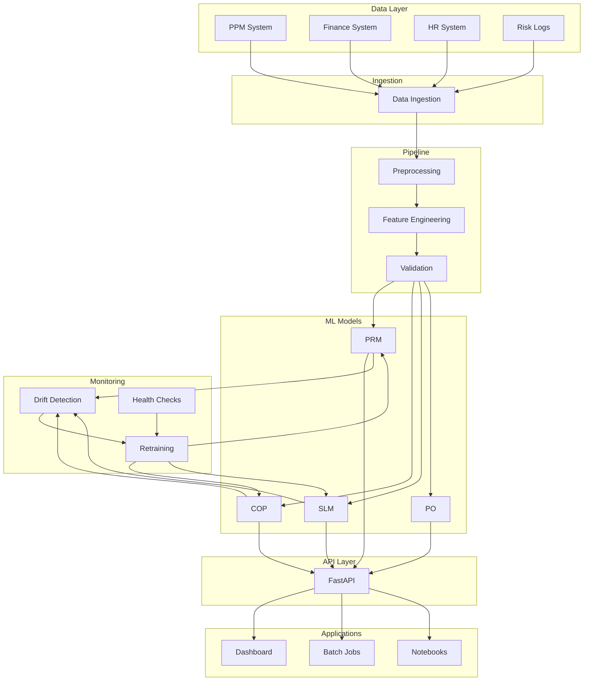
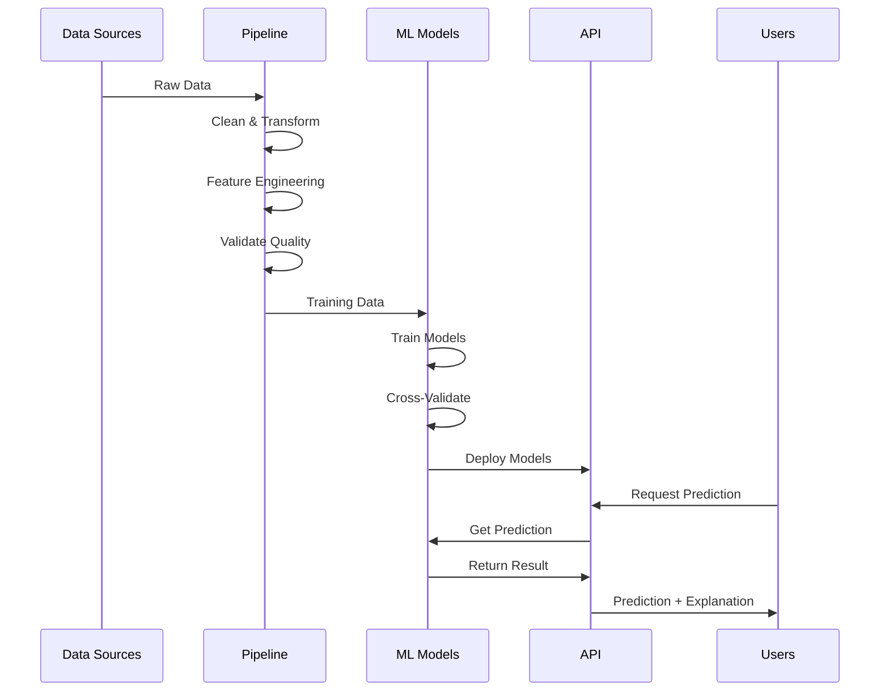
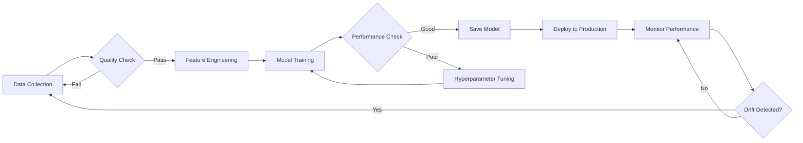

# 🏗️ Architecture Documentation

## System Architecture



## ML Pipeline Flow



## Model Training Workflow



## Component Interaction

```
┌─────────────────────────────────────────────────────────┐
│                    Portfolio ML System                   │
├─────────────────────────────────────────────────────────┤
│                                                           │
│  ┌──────────┐  ┌──────────┐  ┌──────────┐  ┌─────────┐ │
│  │   PRM    │  │   COP    │  │   SLM    │  │   PO    │ │
│  └────┬─────┘  └────┬─────┘  └────┬─────┘  └────┬────┘ │
│       │             │              │             │      │
│       └─────────────┴──────────────┴─────────────┘      │
│                           │                              │
│                      ┌────▼────┐                         │
│                      │ FastAPI │                         │
│                      └────┬────┘                         │
│                           │                              │
│       ┌───────────────────┼───────────────────┐          │
│       │                   │                   │          │
│  ┌────▼─────┐      ┌──────▼──────┐    ┌──────▼──────┐  │
│  │Dashboard │      │Batch Predict│    │Explainability│  │
│  └──────────┘      └─────────────┘    └─────────────┘  │
│                                                           │
└─────────────────────────────────────────────────────────┘
```

## Data Flow

```
Raw Data → Ingestion → Cleaning → Feature Engineering → Validation
    ↓
Training Data → Model Training → Cross-Validation → Model Saving
    ↓
Production Model → Predictions → Explanations → Audit Logs
    ↓
Monitoring → Drift Detection → Alerts → Retraining (if needed)
```

## Deployment Architecture

```
┌─────────────────┐
│   GitHub Repo   │
└────────┬────────┘
         │
    ┌────▼────┐
    │GitHub   │
    │Actions  │
    └────┬────┘
         │
    ┌────▼────────┐
    │Build & Test │
    └────┬────────┘
         │
    ┌────▼─────┐
    │  Docker  │
    │  Image   │
    └────┬─────┘
         │
    ┌────▼──────────┐
    │  Kubernetes   │
    │  Deployment   │
    └───────────────┘
```
