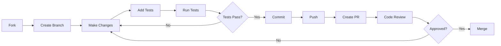

# 🤝 Contributing to Portfolio ML

We love your input! We want to make contributing to Portfolio ML as easy and transparent as possible.

## 📋 Development Process



## 🎯 How to Contribute

### 1. Fork & Clone
```bash
gh repo fork migdam/Project_Portfolio --clone
cd Project_Portfolio
```

### 2. Create Branch
```bash
git checkout -b feature/amazing-feature
```

### 3. Make Changes
- Write clean, documented code
- Follow existing code style
- Add tests for new features

### 4. Test Your Changes
```bash
./run.sh format  # Format code
./run.sh lint    # Check style
./run.sh test    # Run tests
```

### 5. Commit
```bash
git add .
git commit -m "✨ Add amazing feature"
```

**Commit Message Guidelines:**
- ✨ `:sparkles:` New feature
- 🐛 `:bug:` Bug fix
- 📚 `:books:` Documentation
- 🎨 `:art:` Code style/formatting
- ♻️ `:recycle:` Refactoring
- ✅ `:white_check_mark:` Tests
- 🚀 `:rocket:` Performance

### 6. Push & Create PR
```bash
git push origin feature/amazing-feature
gh pr create --title "Add amazing feature" --body "Description..."
```

## 📝 Code Style

- Follow PEP 8 for Python code
- Use type hints where possible
- Document functions with docstrings
- Keep functions focused and small

## ✅ Pull Request Checklist

- [ ] Code follows project style guidelines
- [ ] Self-review completed
- [ ] Comments added to complex code
- [ ] Documentation updated
- [ ] Tests added/updated
- [ ] All tests pass locally
- [ ] No console warnings/errors

## 🧪 Testing Guidelines

```bash
# Run all tests
pytest tests/ -v

# Run specific test file
pytest tests/test_models.py

# Run with coverage
pytest --cov=. --cov-report=html
```

## 📖 Documentation

- Update README.md if needed
- Add docstrings to new functions
- Update WARP.md for AI assistance
- Include examples where helpful

## 🐛 Reporting Bugs

**Great bug reports** include:
- Summary of the issue
- Steps to reproduce
- Expected behavior
- Actual behavior
- Environment details
- Screenshots (if applicable)

## 💡 Feature Requests

We welcome feature suggestions! Please include:
- Clear description
- Use case/motivation
- Proposed solution
- Alternatives considered

## 📜 License

By contributing, you agree that your contributions will be licensed under the MIT License.
