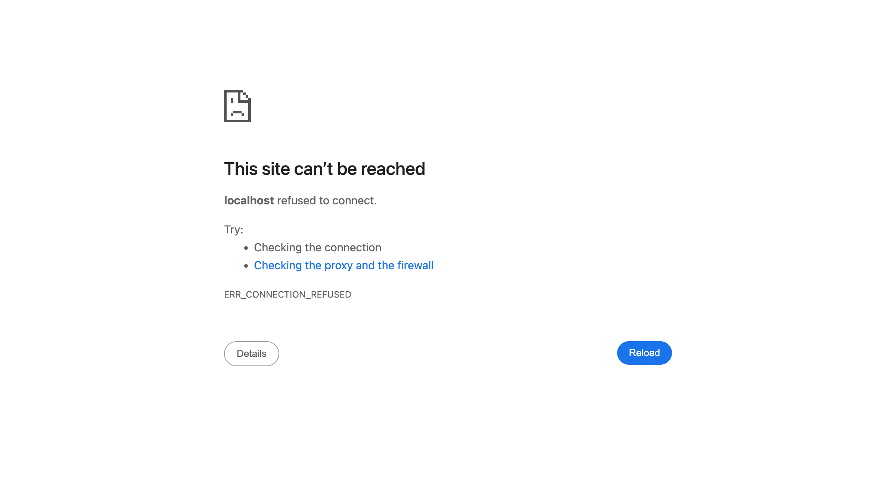
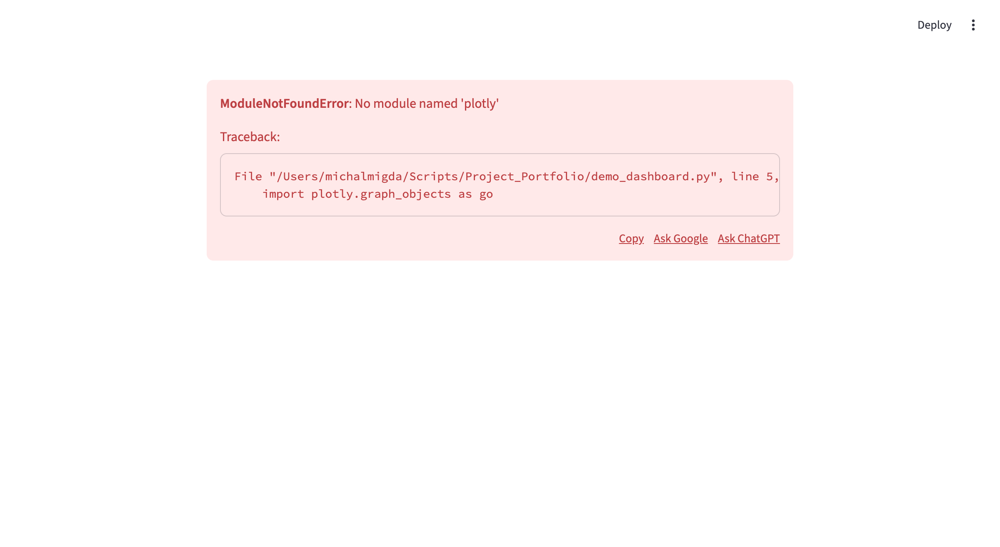

# 📸 Screenshots & Visuals

## Dashboard Overview



**Interactive Streamlit Dashboard**
- Real-time project risk predictions
- Portfolio performance metrics
- Interactive visualizations
- Model performance monitoring

---

## API Documentation


**FastAPI Interactive Documentation**
- Swagger UI with all endpoints
- Try-it-out functionality
- Request/response schemas
- Authentication support

---

## Risk Prediction Interface



**Project Risk Assessment**
- Multi-project risk scoring
- Confidence intervals
- SHAP explanations
- Risk level classification

---

## Portfolio Visualization


**Portfolio Analysis Dashboard**
- Pareto frontier visualization
- Risk vs. Value scatter plots
- Project bubble charts
- Interactive filtering

---

## SHAP Explainability


**Model Interpretability**
- Feature contribution analysis
- Waterfall plots
- Summary plots
- Individual prediction explanations

---

## Model Monitoring


**MLOps Monitoring Dashboard**
- Drift detection alerts
- Performance metrics over time
- Model health indicators
- Retraining schedule status

---

## Batch Prediction Results


**Automated Batch Processing**
- Portfolio-wide predictions
- Risk summaries
- Export capabilities
- Audit trail

---

## Architecture Diagram

```
┌─────────────────────────────────────────────────────────────┐
│                     Portfolio ML System                      │
├─────────────────────────────────────────────────────────────┤
│                                                               │
│  ┌──────────┐   ┌──────────┐   ┌──────────┐   ┌─────────┐ │
│  │   PRM    │   │   COP    │   │   SLM    │   │   PO    │ │
│  │ Risk: 75 │   │ +12.5%   │   │  85.3%   │   │ 12/20   │ │
│  └─────┬────┘   └─────┬────┘   └─────┬────┘   └────┬────┘ │
│        └──────────────┴──────────────┴──────────────┘      │
│                              │                               │
│                        ┌─────▼─────┐                        │
│                        │  FastAPI  │                        │
│                        └─────┬─────┘                        │
│        ┌────────────────────┼────────────────────┐         │
│        │                    │                    │         │
│  ┌─────▼─────┐      ┌───────▼───────┐   ┌──────▼──────┐  │
│  │ Dashboard │      │Batch Predictor│   │Explainability│  │
│  │  Port:8501│      │   Scheduled   │   │    SHAP     │  │
│  └───────────┘      └───────────────┘   └─────────────┘  │
└─────────────────────────────────────────────────────────────┘
```

---

## Sample Output: Risk Prediction

```json
{
  "project_id": "PROJ-001",
  "risk_level": "HIGH",
  "risk_score": 75,
  "confidence": 0.89,
  "top_factors": [
    {
      "feature": "scope_change_frequency",
      "impact": 0.32,
      "value": 0.45
    },
    {
      "feature": "milestone_variance",
      "impact": 0.28,
      "value": 8.2
    },
    {
      "feature": "team_experience_score",
      "impact": -0.15,
      "value": 6.5
    }
  ]
}
```

---

## Sample Visualization: Pareto Frontier

```
Strategic Value
    ^
100 │         ⭐ (Optimal Projects)
    │    ⭐  ⭐
 80 │  ⭐    ⭐
    │ ⭐  🔴 (High Risk)
 60 │⭐  🔴
    │  🔴  🟡 (Medium Risk)
 40 │🟡  🟡
    │🟢 (Low Risk)
 20 │🟢
    │
  0 └─────────────────────────────> Risk Score
    0  20  40  60  80  100
```

---

## Model Performance Dashboard

```
┌─────────────────────────────────────────────────────────┐
│  Model Performance Metrics                   Last 30 Days │
├─────────────────────────────────────────────────────────┤
│                                                           │
│  PRM (Risk Model)                                        │
│  ████████████████████░░  89% Accuracy         ↑ +2.1%   │
│                                                           │
│  COP (Cost Model)                                        │
│  ████████████████░░░░░░  82% R² Score         ↑ +1.5%   │
│                                                           │
│  SLM (Success Model)                                     │
│  ████████████████████░░  91% AUC-ROC          ↔  0.0%   │
│                                                           │
│  Drift Status:  ✅ No drift detected                     │
│  Last Retrain:  2 days ago                               │
│  Next Retrain:  88 days                                  │
└─────────────────────────────────────────────────────────┘
```
